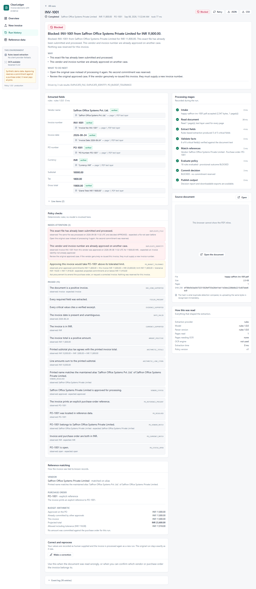

# ClearLedger

**Invoice decisions with evidence.**

ClearLedger turns a vendor invoice PDF into an explainable processing decision
against a purchase-order dataset. It is a one-week prototype.

> **APPROVED does not send money.** An approval reserves a commitment against a
> purchase order so that later invoices see the reduced balance. Nothing in this
> application initiates, schedules, or authorises a payment.

---

## The problem

An accounts payable analyst receives an invoice PDF and has to answer three
questions before anything can be paid:

1. Is this a real invoice from a vendor we deal with, and have we seen it before?
2. Does it match a purchase order we actually approved, and is there budget left?
3. Do the numbers on the page hold together?

Doing this by hand is slow and error-prone; handing it to a model wholesale is
worse, because you get an answer with no way to check it. ClearLedger splits the
job: a model (or a deterministic parser) **reads** the document, and explicit
rules **decide**. Every extracted value is shown with the text it came from, and
every decision names the rules that produced it.

## What it does

Upload a PDF, or run one of fourteen bundled synthetic samples. The server:

1. **Intake** — validates the file is a real PDF, hashes it, stores it.
2. **Read document** — pulls the text layer; runs OCR only on pages that need it.
3. **Extract fields** — produces typed invoice facts, each with a quoted excerpt.
4. **Validate facts** — checks every excerpt against the real page text.
5. **Match references** — resolves the vendor and purchase order, conservatively.
6. **Evaluate policy** — applies deterministic rules. No model is involved here.
7. **Commit decision** — writes the decision and any commitment atomically.
8. **Publish output** — makes the report and exports available.

The result is one of three outcomes:

| Outcome | Meaning |
| --- | --- |
| **APPROVED** | Eligible under the demo policy. A commitment is reserved against the PO. |
| **REVIEW** | A person needs to resolve an uncertainty or a discrepancy. |
| **BLOCKED** | A specific policy prohibition or a duplicate identity prevents processing. |

A technical failure is never one of these. A run that crashes is `FAILED`, is
labelled as a technical problem, and can be retried — it is not a judgement
about the invoice.



## Quick start

### Option A — Docker (closest to how it is deployed)

```bash
cp .env.example .env
# Set DEMO_USERNAME and a DEMO_PASSWORD of at least 12 characters.
docker compose up --build
```

Open <http://localhost:8000> and sign in with those credentials.

Processed runs live in the `clearledger-data` volume and survive
`docker compose restart` and `docker compose up --build`. To start clean:
`docker compose down -v`.

### Option B — Local development

Requirements: Python 3.11 or newer, Node 20 or newer. Tesseract is optional; without
it, scanned pages route to review instead of being read.

```bash
# 1. Backend
python -m venv .venv
.venv/Scripts/activate            # Windows;  source .venv/bin/activate elsewhere
pip install -r backend/requirements-dev.txt

# 2. Sample PDFs and reference data
python scripts/generate_samples.py
python scripts/manage.py seed

# 3. Run the API
$env:PYTHONPATH="$PWD/backend"    # Windows;  export PYTHONPATH=$PWD/backend elsewhere
uvicorn app.main:app --app-dir backend --reload --port 8000

# 4. Run the frontend (separate terminal)
cd frontend && npm install && npm run dev
```

The dev frontend runs on <http://localhost:5173> and proxies `/api` to port 8000.
To serve the built frontend from FastAPI on a single origin instead, run
`npm run build` and start the API with `STATIC_DIR=frontend/dist`.

Install Tesseract if you want OCR:

- Windows: `winget install --id UB-Mannheim.TesseractOCR`
- macOS: `brew install tesseract`
- Debian/Ubuntu: `apt-get install tesseract-ocr tesseract-ocr-eng`

`GET /api/capabilities` reports whether it was found, and the UI shows the same
thing in the sidebar.

## Running the checks

```bash
# Backend and domain tests (147 tests, no server required)
python -m pytest

# Backend lint and formatting
python -m ruff check backend scripts
python -m ruff format --check backend scripts

# Frontend
cd frontend && npm run typecheck && npm run lint && npm run build

# Browser journeys — needs a running server on http://127.0.0.1:8000
cd frontend && npm run e2e

# Layout at 1440/1024/390 px, plus the screenshots in docs/screenshots
cd frontend && npm run screenshots

# Every documented scenario, end to end, against a running server
python scripts/manage.py reset-demo --confirm RESET   # server must be stopped
python scripts/smoke_demo.py

# Regenerate fixtures and check the reference CSVs
python scripts/generate_samples.py
python scripts/manage.py validate-reference

# Docker build and container smoke test
docker build -t clearledger:latest .
docker run -d -p 8000:8000 -v clearledger-data:/data \
  -e DEMO_USERNAME=reviewer -e DEMO_PASSWORD='a-long-password' clearledger:latest
python scripts/smoke_demo.py --username reviewer --password 'a-long-password'

# Is it up, and what can it do?
curl http://127.0.0.1:8000/api/readiness
python scripts/manage.py capabilities
```

If the server is protected, point the browser suite at it with
`BASE_URL`, `DEMO_USERNAME` and `DEMO_PASSWORD` in the environment.

Observed results are recorded in [docs/VALIDATION.md](docs/VALIDATION.md).

## Try it in this order

The samples are designed to be demonstrated in sequence, because several of them
only behave correctly once an earlier one has been processed.

1. **Happy path — clean invoice with an explicit PO.** Approved; reserves
   INR 11,800.00 against PO-1001.
2. **E1 — the same invoice, re-rendered in a different layout.** Different bytes,
   same vendor and invoice number. Blocked as a duplicate identity.
3. **E2 parts 1, 2 and 3 — split invoices against one PO.** The first two are
   approved; the third is only INR 1,000.00 but breaks the running total, so it
   goes to review.
4. **E3 — image-only scan with no PO reference.** Read by OCR, sent to review
   with ranked PO suggestions. Confirm PO-3001 as a correction and it is approved
   as a new run, with the original left untouched.
5. **E4 — a printed total its own subtotal and tax do not support.** Review.

Seven further samples cover a blocked vendor, a PO belonging to another vendor, a
missing invoice number, an unsupported currency, a credit note, instructions
hidden in the document body, and a genuinely unreadable scan.

All sample vendors, amounts and identifiers are fictional.

## Extraction modes

| Mode | Setting | What it needs |
| --- | --- | --- |
| Deterministic rules (default) | `EXTRACTION_PROVIDER=rules` | Nothing. Runs offline. |
| Local model | `EXTRACTION_PROVIDER=ollama` + `OLLAMA_MODEL` | Ollama running locally. |
| Hosted model | `EXTRACTION_PROVIDER=openai_compatible` + `LLM_BASE_URL`, `LLM_API_KEY`, `LLM_MODEL` | A reachable OpenAI-compatible endpoint. |

The mode in force is shown in the UI and reported by `/api/capabilities`; a run
records which provider and model actually produced its facts. A provider failure
is never silently swapped for a different provider's output — that only happens
if you explicitly set `ALLOW_RULES_FALLBACK=true`, and the fallback is recorded
on the run.

**A hosted deployment cannot reach Ollama on your laptop.** `localhost` inside a
container or on a cloud host is that machine, not yours. Either deploy in rules
mode, or point `LLM_BASE_URL` at a service that is genuinely reachable and
authenticated. Do not open an unauthenticated Ollama port to the internet.

## Repository map

```
backend/app/
  main.py            application entry point, routes, static mount, lifespan
  config.py          settings, DATA_DIR resolution
  api/               routes, error contract, auth, serializers
  db/                SQLAlchemy models and session/transaction handling
  domain/            money, normalization, matching, policy, decisions
  services/          documents, extraction, workflow, queue, ledger, exports, ocr
  providers/         rules parser, Ollama, OpenAI-compatible adapters
backend/tests/       pytest suite
frontend/src/        React app; features/ holds one folder per screen
frontend/e2e/        Playwright journeys and screenshot capture
data/reference/      vendors.csv and purchase_orders.csv — the editable source
data/samples/        generated PDFs, catalog.json, expected_results.json
prompts/             the extraction system prompt used by model providers
scripts/             sample generator, maintenance CLI, scenario smoke test
docs/                the documents listed below
Dockerfile           one image: API, built frontend, Tesseract
render.yaml          Render blueprint: service, persistent disk, health check
```

## Documentation

| Document | What is in it |
| --- | --- |
| [docs/PROCESS.md](docs/PROCESS.md) | The pipeline as a diagram, with the failure and uncertainty branches |
| [docs/ARCHITECTURE.md](docs/ARCHITECTURE.md) | Components, data boundaries, the queue, atomic approval, why this shape |
| [docs/ASSUMPTIONS.md](docs/ASSUMPTIONS.md) | Scope boundaries, and every domain decision that could reasonably have gone another way |
| [docs/TEST_CASES.md](docs/TEST_CASES.md) | The scenarios, their prerequisites, and the rule codes each should produce |
| [docs/VALIDATION.md](docs/VALIDATION.md) | Commands actually run, actual output, and what remains unverified |
| [docs/DEPLOYMENT.md](docs/DEPLOYMENT.md) | Docker, hosting on Render, persistent disk, reviewer access |
| [docs/DEMO_SCRIPT.md](docs/DEMO_SCRIPT.md) | A rehearsable sub-five-minute walkthrough |
| [docs/INTERVIEW_NOTES.md](docs/INTERVIEW_NOTES.md) | Explanations of each design decision, with the file to look at |
| [docs/BUSINESS_IMPACT.md](docs/BUSINESS_IMPACT.md) | KPIs worth measuring, and which numbers here are assumptions |
| [docs/SUBMISSION.md](docs/SUBMISSION.md) | Draft submission email with placeholders |
| [docs/BUILD_STATUS.md](docs/BUILD_STATUS.md) | What is done, what is not, and the next concrete step |
