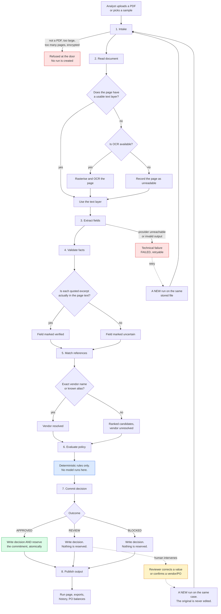

# The process

Eight stages, in order, every time. Each stage writes durable events as it runs,
which is what the live view reads and what the audit trail keeps afterwards.

## The pipeline

## What each stage is for

### 1. Intake

*Business purpose:* refuse obviously unusable input before spending anything on
it, and make the file identifiable forever after.

The file is streamed to disk with a size cap enforced while reading, not after
buffering. The bytes are hashed with SHA-256. That hash is what duplicate
detection compares later, and what proves in an export that the decision refers
to this exact document. A file that is not a PDF, is encrypted, is corrupt, or
exceeds the page limit is refused here and no run is created — there is nothing
to explain, so there is no case to open.

*Human involvement:* none.
*Code:* `backend/app/services/documents.py`

### 2. Read document

*Business purpose:* get the words off the page, and be honest about how.

Most invoices are generated digitally and have a text layer, which is exact and
free. Scans do not. Each page is examined separately: if its text layer is
missing or too sparse to be real content, that page — and only that page — is
rasterised and passed to Tesseract. The provenance of every page (`pdf_text` or
`ocr`) is recorded, because OCR is a source of error and a reviewer deserves to
know which numbers came through it.

If OCR is unavailable, the page is recorded as unreadable rather than silently
treated as empty. That distinction is what stops a missing dependency from
looking like a blank invoice.

*Human involvement:* none.
*Code:* `backend/app/services/extraction.py`, `services/pdf_text.py`, `services/ocr.py`

### 3. Extract fields

*Business purpose:* turn prose into typed facts, and require a source for each.

The configured provider — the deterministic parser, a local Ollama model, or a
hosted OpenAI-compatible model — returns a fixed schema: vendor, invoice number,
date, PO reference, currency, subtotal, tax, gross total, line items, document
kind. Every value must arrive with the page number and the exact excerpt it came
from. A provider that cannot find a value must say so; it must not guess.

A failure here is technical, not a business rejection. The run ends `FAILED`
with a retryable error, and the invoice gets no decision at all.

*Human involvement:* none.
*Code:* `backend/app/providers/`, `prompts/invoice_extraction.md`

### 4. Validate facts

*Business purpose:* stop an invented value from ever reaching a rule.

This is the stage that makes model extraction safe to use. Each cited excerpt is
searched for in the actual page text, ignoring harmless whitespace differences.
A value whose excerpt cannot be found is labelled **uncertain** — it is not
deleted, because it may well be right, but the policy rules treat an uncertain
critical field as grounds for review rather than approval.

The same check runs whichever provider produced the facts, so swapping in a
model does not change the trust model.

*Human involvement:* none.
*Code:* `verify_evidence` in `backend/app/services/extraction.py`

### 5. Match references

*Business purpose:* connect the invoice to records we actually hold, and refuse
to guess when it is not clear.

Vendor matching is exact: the normalised canonical name, or a known alias.
Normalisation absorbs case, spacing, punctuation, and legal-form suffixes
(`Pvt. Ltd.` and `Private Limited` are the same company), but nothing more.
If there is no exact match, the vendor is **not** resolved — instead, similar
vendors are ranked and offered to a human. A fuzzy match is a suggestion for a
person, never an automatic decision.

The purchase order is taken from the reference printed on the invoice when there
is one. When there is not, candidates are ranked by vendor, currency and
remaining balance, and the invoice goes to review.

*Human involvement:* this is where most review outcomes originate. A reviewer
confirms the vendor or PO and reprocesses.
*Code:* `backend/app/domain/matching.py`, `domain/normalization.py`

### 6. Evaluate policy

*Business purpose:* decide, reproducibly, with a reason for every outcome.

Every rule is a pure function of the facts and the resolved references. No model
is consulted. Each rule returns a code, a status, a severity, what was observed,
what was expected, and the next action. The decision is composed from those
statuses: any blocking failure gives BLOCKED, any review-severity finding gives
REVIEW, and only a clean sheet gives APPROVED.

Because it is deterministic, the same document against the same reference data
gives the same decision every time — which is what makes the audit trail worth
anything.

*Human involvement:* none, by design.
*Code:* `backend/app/domain/policy.py`, `domain/decisions.py`

### 7. Commit decision

*Business purpose:* make the decision and its financial consequence a single,
indivisible fact.

For an approval, the decision and the commitment against the purchase order are
written in one immediate write transaction, which re-reads the PO's committed
total and re-checks duplicates inside the lock. Two runs deciding the same
invoice at the same instant cannot both commit: a unique partial index on active
reservations makes the second one fail rather than double-count.

REVIEW and BLOCKED commit nothing. The PO balance is untouched.

*Human involvement:* none.
*Code:* `_commit_decision` in `backend/app/services/workflow.py`, `services/ledger.py`

### 8. Publish output

*Business purpose:* make the result inspectable and portable.

The run page, the JSON export (full provenance: hash, provider, evidence, rule
results, snapshots, event log, lineage) and the CSV export (a flat summary for a
spreadsheet) all become available. The policy and reference snapshots are stored
on the run, so a decision can still be explained after the CSVs change.

*Human involvement:* the reviewer reads it.
*Code:* `backend/app/services/exports.py`, `api/serializers.py`

## Where a human actually intervenes

There are exactly three points:

1. **A REVIEW outcome.** The reviewer reads the reasons, and either corrects a
   misread value or confirms which vendor or PO the invoice belongs to.
2. **A BLOCKED outcome.** Nothing in the app resolves this; it is a decision to
   take outside the system (raise a new PO, contact the vendor, unblock them).
3. **A technical failure.** The reviewer retries, or the file genuinely cannot
   be processed and goes back to the vendor.

A correction never edits the original run. It creates a **new** run on the same
case, with the reviewer's values marked `human_supplied` and the reason recorded
in a `ReviewAction`. Both runs remain readable side by side. This is the
difference between an audit trail and a database with an UPDATE statement.

## Failure and uncertainty, summarised

| What went wrong | What happens | Recoverable by |
| --- | --- | --- |
| Not a PDF, too big, encrypted, corrupt | Refused at intake; no run created | Uploading a valid file |
| A page has no text layer and OCR is off | Page recorded unreadable; fields missing → REVIEW | Installing Tesseract, or manual entry |
| The extraction provider is unreachable | Run `FAILED`, retryable, no decision | Retry, or switch provider |
| A model returns unparseable output | One repair attempt, then `FAILED` | Retry |
| A quoted excerpt is not in the page | Field marked uncertain → REVIEW | Reviewer confirms the value |
| The vendor name does not match exactly | Candidates offered → REVIEW | Reviewer confirms the vendor |
| No PO reference on the invoice | Candidates ranked → REVIEW | Reviewer confirms the PO |
| The server restarts mid-run | Run marked `INTERRUPTED` on startup; nothing committed | Retry |
| Two runs race to approve the same invoice | One commits, the other fails the uniqueness check | Nothing; this is the guard working |
